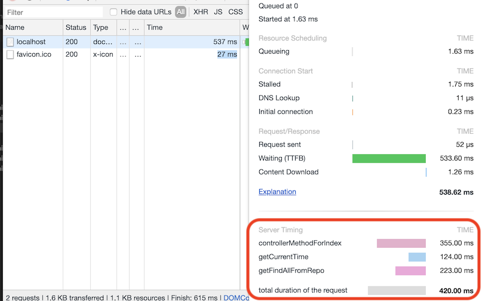

# Sample project using the HTTP Server Timings library 


# Installation
  - add the dependency as done in this example at [pom.xml](pom.xml):
```
        <dependency>
            <groupId>io.github.sercasti</groupId>
            <artifactId>spring-httpserver-timings</artifactId>
            <version>0.0.8</version>
        </dependency>
```
  
  - add these Beans to your spring config, as this example does at [SpringServertimingsExampleApplication.java](/src/main/java/io/github/sercasti/springservertimingsexample/SpringServertimingsExampleApplication.java):
```
    @Bean
    protected Tracing tracing() {
        return TracingConfig.createTracing();
    }

    @Bean
    protected TracingFilter tracingFilter() {
        return new TracingFilter();
    }
    
    @Bean
    protected TracingInterceptor tracingInterceptor() {
        return new TracingInterceptor(tracing());
    }
```

# Instructions
  - Use the @Traceable annotation as [ExampleController.java](/src/main/java/io/github/sercasti/springservertimingsexample/controller/ExampleController.java) does
  - or autowire/inject the Tracing interface and use it on a specific block of code, as [ExampleService.java](/src/main/java/io/github/sercasti/springservertimingsexample/service/ExampleService.java) does

# Test it
  - Start this project with spring-boot:run, open localhost:8080, and check your network console on chrome:
  
